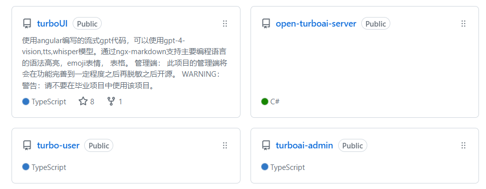
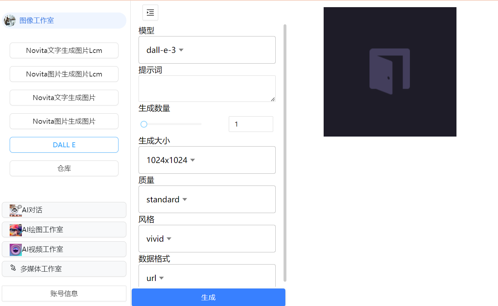
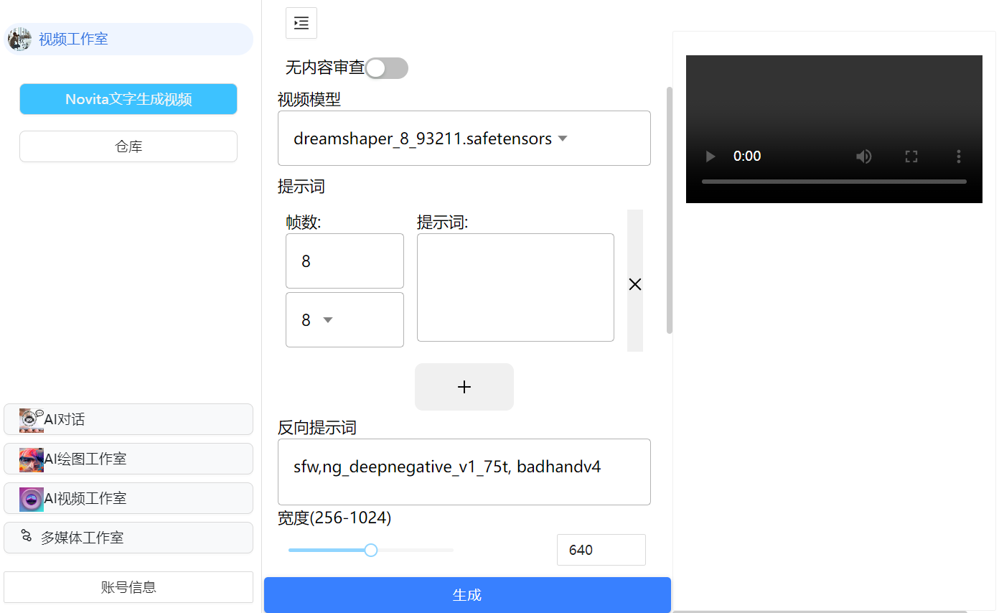
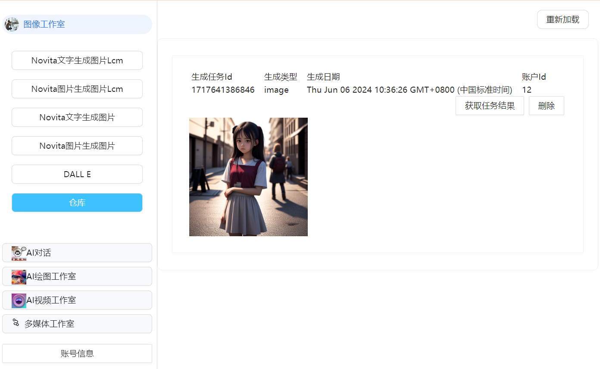
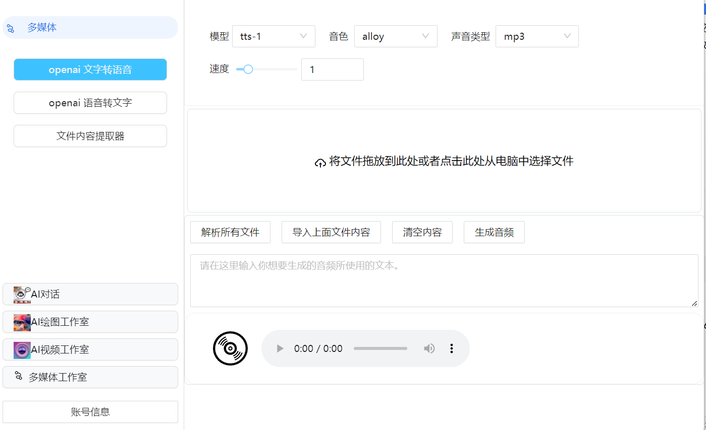
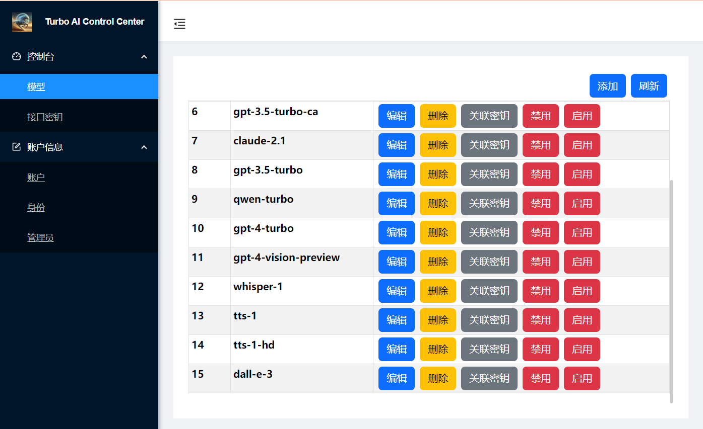
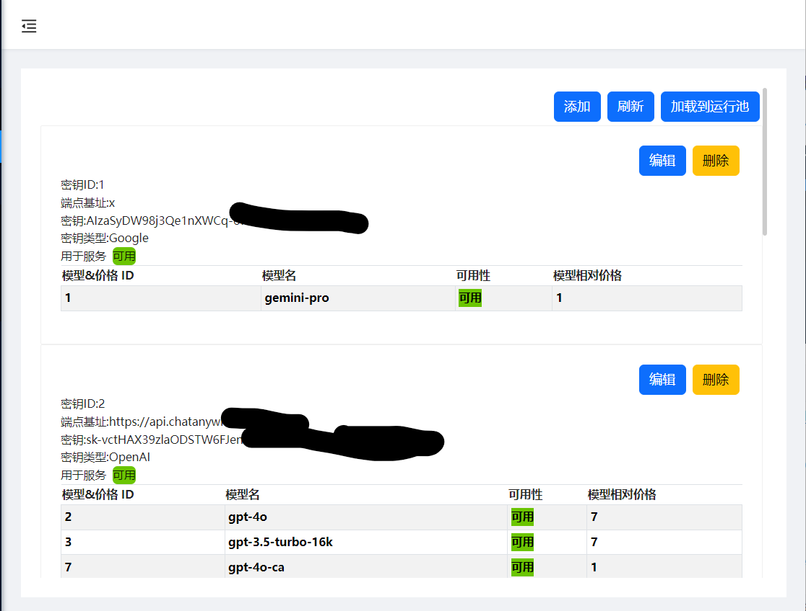
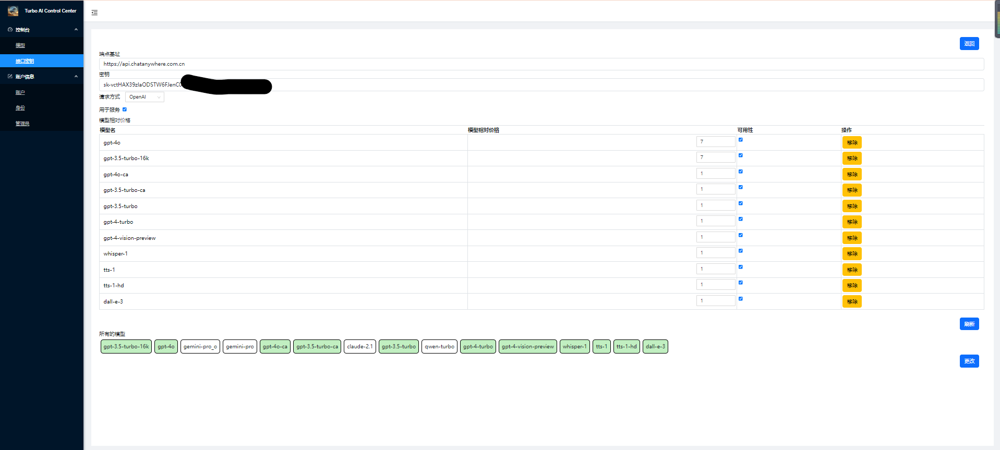

## 项目介绍
本项目继承于turboUI
  
以下3个项目为turboai项目的完整部分。
- project 1 turbo-user (turboai-user)
- project 2 turboai-admin
- project 3 open-turboai-server  
其中`open-turboai-server`承担后端服务器的角色，使用.net 8.0开发，提供restful api服务。
主要的功能是： 权限认证，账号的管理，密钥和模型的管理，消息的同步（对话），
同时为 ai对话，ai绘图，ai视频，tts，stt等提供接口服务。  
`turbo-user`主要是用户所使用的用户端，用户可以使用
ai对话，ai绘图，ai视频生成，tts和stt服务。  
`turboai-admin`为管理端，和用户端一样使用angular17开发。主要的功能是
模型管理，密钥管理，账户管理等。  
管理员可以轻松的添加密钥，本系统支持多种密钥，并
依据与密钥关联的模型为用户提供服务。
本系统支持： openai gpt(转发与原生)，google gemini（原生），claude（原生），
阿里 qwen（原生）。  
绘画支持： novita.ai, openai  
语音 <-> 文字 openai
- ai 对话  
支持文件（部分文件类型，如word，pdf，txt，*.code）

- ai 绘图

- ai 视频生成

图像生成和视频生成均会保留生成记录，（以链接形式生成的结果会在一定时间失效，如果生成的结果满意请尽快下载）

- 多媒体（tts，stt）  
tts支持从文件中提取文字

### turboai-admin
#### 模型管理

#### 密钥管理
（90%）

（50%）

